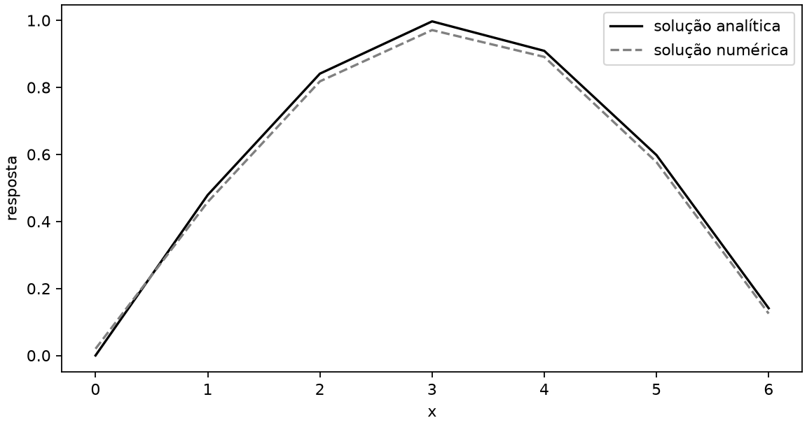

# Workflow de Pesquisa Computacional

Uma pesquisa computacional pode começar com um script pequeno e, alguns meses depois, ficar difícil de retomar: aparecem cópias do mesmo arquivo, nomes como `final`, `final2` e `final_agora`, figuras sem origem clara e dúvidas sobre qual resultado entrou no relatório.

Este repositório mostra um caminho curto para evitar parte desse trabalho sem exigir formação prévia em desenvolvimento de software. O projeto foi pensado principalmente para iniciação científica e pesquisa computacional, mas as mesmas práticas também são úteis em disciplinas e projetos técnicos nos quais código, modelos ou simulações produzem resultados que precisam ser organizados e comunicados:

```text
dados → código, modelo ou simulador → resultados persistidos → comunicação
```

## Veja o fluxo funcionando

O [mini-projeto](examples/mini-project/README.md) percorre esse caminho com dados sintéticos, um script pequeno, tabelas e figura persistidas, relatório e apresentação.

- [Execute o exemplo do zero](docs/quickstart.md).
- [Veja a estrutura e os arquivos do mini-projeto](examples/mini-project/README.md).

## Uma estrutura que você pode adaptar

Depois de ver o exemplo, reconheça as partes que costuma precisar no seu próprio projeto:

```text
meu-projeto/
├── README.md
├── data/
├── src/
├── results/
└── docs/
```

`data/` guarda entradas adequadas para o repositório. `src/` contém código, modelos ou scripts. `results/` reúne tabelas e figuras produzidas. `docs/` guarda relatórios, notas e apresentações. O `README.md` explica o que o projeto investiga, como executar a análise e onde encontrar os resultados.

Os nomes podem mudar conforme o seu domínio. A separação só precisa ajudá-lo a encontrar entradas, método, resultados e comunicação quando o trabalho crescer.

## Poucas práticas úteis desde o começo

- Use Git para guardar o histórico sem criar várias cópias do mesmo arquivo. Veja [Git: o mínimo para começar](docs/git-basics.md).
- Faça o código produzir tabelas e figuras; assim a origem de cada resultado fica mais fácil de reconhecer.
- Escreva relatórios e slides em Markdown `.md` para manter o texto simples e versionável.
- Adicione uma ferramenta nova quando ela resolver um problema real. Os nomes e caminhos ficam em [ferramentas opcionais](docs/extras/tooling-landscape.md).

## Markdown para comunicar resultados

No arquivo, Markdown continua sendo apenas texto simples e legível:

```text
# Resultado do experimento

## Hipótese

Considere um nível de significância α = 0,05 e represente o desvio-padrão por σ.

> A comparação deve ser feita com a solução analítica de referência.

## Métrica

O erro quadrático médio é dado por:

$$
RMSE = \sqrt{\frac{1}{n}\sum_{i=1}^{n}(y_i-\hat{y}_i)^2}
$$

O resultado calculado é **salvo** em `summary.csv`.


```

Ao renderizar, uma versão equivalente vira uma apresentação formatada:

### Resultado do experimento

#### Hipótese

Considere um nível de significância α = 0,05 e represente o desvio-padrão por σ.

> A comparação deve ser feita com a solução analítica de referência.

#### Métrica

O erro quadrático médio é dado por:

$$
RMSE = \sqrt{\frac{1}{n}\sum_{i=1}^{n}(y_i-\hat{y}_i)^2}
$$

O resultado calculado é **salvo** em `summary.csv`.


Você pode ler e editar o arquivo sem nenhuma ferramenta especial. Quando precisar compartilhar, [MyST](https://mystmd.org/) gera site e documentos, e [Marp](https://marp.app/) gera apresentações. Os comandos ficam em [Markdown e renderização](docs/markdown-rendering.md); [Pandoc](https://pandoc.org/) fica como opção de conversão quando necessário.

## Nem todo dado deve estar no projeto

Dados públicos ou sintéticos podem fazer parte do repositório. Dados proprietários, pessoais, confidenciais ou sujeitos a contrato podem permanecer em armazenamento autorizado separado. Resultados derivados também podem continuar sujeitos às restrições da fonte, e o código acessa os dados autorizados quando necessário.

```text
workspace/
├── research-project/
└── protected-data/
```

Mantenha no repositório apenas dados, código, documentação e resultados apropriados para versionamento e compartilhamento.

## Continue quando precisar

- [Experimente este repositório](docs/quickstart.md): clone, execução e primeira saída renderizada.
- [Git: o mínimo para começar](docs/git-basics.md): histórico de versões sem transformar o arquivo em `final3`.
- [Markdown e renderização](docs/markdown-rendering.md): site, documento e slides.
- [Referências e caminhos de estudo](docs/references.md): fontes e materiais de aprofundamento.
- [Ferramentas e caminhos para explorar](docs/extras/tooling-landscape.md): opções para problemas que apareçam mais tarde.

Quer contribuir com um exemplo ou estilo que você realmente usa? Veja [CONTRIBUTING.md](CONTRIBUTING.md).

As práticas deste repositório se apoiam em trabalhos como *Good Enough Practices in Scientific Computing*, *The Turing Way*, Software Carpentry e o [Kit de sobrevivência digital para cientistas](https://github.com/compgeolab/kit), do CompGeoLab/IAG-USP. Veja as referências completas em [docs/references.md](docs/references.md).

As decisões de manutenção, limites do escopo e alternativas consideradas estão no [ADR-0001](docs/decisions/ADR-0001-markdown-first-research-workflow.md).
