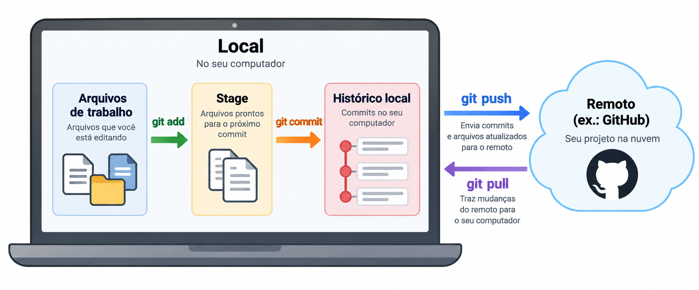
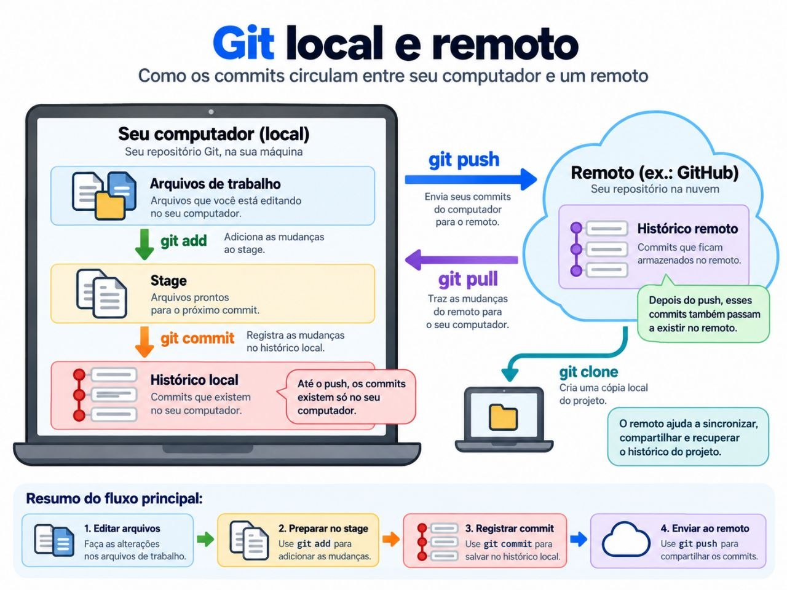

# Git: o mínimo para começar

Git é um sistema de controle de versão: ele registra marcos da evolução do projeto ao longo do tempo. Em pesquisa computacional, isso ajuda a entender o que mudou, comparar resultados e recuperar estados anteriores sem depender de várias cópias do mesmo arquivo.

Em vez de:

```text
analise.py
analise_nova.py
analise_final.py
analise_final2.py
```

mantenha um único `analise.py`. **Com Git, a versão deixa de morar no nome do arquivo e passa a morar no histórico do projeto.**

Cada **commit** registra um estado dos arquivos versionados naquele momento, junto com informações como autor, data/hora e uma mensagem descrevendo a mudança. Assim, você pode comparar o projeto atual com marcos anteriores e recuperar uma versão antiga sem precisar manter `final.py`, `final2.py` ou `agora-vai.py`.

## Onde executar os comandos

Os comandos `git ...` desta página são executados em um terminal aberto dentro da pasta do projeto. No Windows, você pode usar PowerShell ou Windows Terminal; no Linux e macOS, o Terminal. Os comandos Git mostrados aqui são os mesmos.

## Git, remoto e GitHub

**Git** é o sistema de controle de versão que funciona no seu computador e registra o histórico do projeto.

Um **remoto** é outro repositório Git, armazenado em outro lugar, com o qual o seu repositório local pode trocar commits. Em projetos pessoais e acadêmicos, é comum que esse remoto fique em um serviço na internet.

**GitHub** é um dos serviços mais usados para hospedar repositórios Git. Ele mantém uma cópia do projeto e do histórico fora do seu computador e também facilita compartilhamento e colaboração.

```text
seu computador                         remoto
Git + arquivos + histórico   ←→   ex.: GitHub
```

Você pode usar Git sem GitHub. É comum pensar no remoto como uma “cópia do projeto na nuvem”, mas ele não recebe automaticamente tudo que está na sua pasta: primeiro as mudanças precisam ser registradas em commits e depois enviadas ao remoto.

Ter os commits também em um remoto reduz o risco de perder todo o histórico caso algo aconteça com o computador local, mas Git/GitHub não substituem necessariamente uma política completa de backup.

## Configuração inicial

Primeiro, confira se o Git está instalado:

```bash
git --version
```

Se o comando não for reconhecido, instale o Git seguindo as [instruções oficiais para seu sistema operacional](https://git-scm.com/install/).

Depois, configure o nome e o e-mail que identificarão os commits que você fizer:

```bash
git config --global user.name "Seu Nome"
git config --global user.email "seu@email.com"
```

Essa configuração normalmente precisa ser feita apenas uma vez para o seu usuário no computador, salvo quando você quiser alterá-la.

## Criar ou obter um repositório

Se o seu projeto já existe como uma pasta local, mas ainda não usa Git, abra o terminal dentro dela e inicialize o repositório:

```bash
git init
```

Se o projeto Git já existe em outro lugar, obtenha uma cópia dele:

```bash
git clone <url>
```

Normalmente é **um ou outro**: use `git init` para começar o histórico de uma pasta local; use `git clone` para obter um projeto Git que já existe.

## Modelo mental do Git

O Git separa três ideias importantes:

1. os arquivos em que você está trabalhando;
2. a seleção do que entrará no próximo marco;
3. o histórico de marcos já registrados.

```text
arquivos de trabalho
      │
      │ git add
      ▼
stage
      │
      │ git commit
      ▼
histórico local
```

O **stage** é simplesmente a seleção do que você quer incluir no próximo commit.

Também vale associar cada comando a uma pergunta:

```text
git diff
→ o que mudou nos arquivos de trabalho?

git add
→ quais mudanças quero incluir no próximo commit?

git diff --staged
→ o que exatamente já escolhi para o próximo commit?

git commit
→ registre esse marco no histórico
```

A relação entre o que acontece no seu computador e o remoto pode ser visualizada assim:

[](assets/git-local-remoto.png)

No computador acontecem a edição, o `git add` e o `git commit`. O `git push` envia commits ao remoto; o `git pull` traz mudanças do remoto para o seu repositório local.

## O ciclo básico

Depois de editar um arquivo, percorra este ciclo curto:

```bash
git status
git diff

git add src/analyze.py
git diff --staged

git commit -m "implementa cálculo do erro quadrático médio"

git log --oneline
```

```text
status
→ o que está diferente?

diff
→ o que eu mudei?

add
→ o que quero incluir no próximo marco?

diff --staged
→ o que exatamente será registrado?

commit
→ registre o marco

log
→ veja os marcos anteriores
```

`git add .` adiciona as mudanças da pasta atual ao stage. Mesmo assim, escolher arquivos individualmente é útil quando alterações diferentes devem virar commits diferentes.

## O que é um commit?

Salvar um arquivo e fazer um commit são coisas diferentes.

Quando você salva no editor, o arquivo atual é atualizado no seu computador. Quando faz um commit, registra um **marco no histórico do projeto**: um estado dos arquivos versionados naquele momento, acompanhado de uma mensagem que ajuda a explicar o que mudou desde o marco anterior.

Por exemplo, em um momento você pode registrar:

```text
implementa cálculo do erro quadrático médio
```

e, depois de encontrar um problema:

```text
corrige cálculo do erro quadrático médio
```

Meses depois, essas mensagens ajudam a reconstruir como a análise evoluiu e por que determinados resultados mudaram.

Outros exemplos úteis:

```text
corrige conversão de pressão para MPa
atualiza figura após filtrar os dados
documenta hipótese usada no experimento
```

Evite mensagens vagas como `changes`, `update` ou `final`: elas dizem pouco sobre o que aconteceu naquele marco.

## Marcos reais em pesquisa

Um commit não precisa ser feito para cada pequena edição. Registre um marco quando a mudança tiver um propósito claro, como:

- primeira análise funcionando;
- entrada de um novo conjunto de dados;
- correção de uma unidade;
- criação de uma nova figura;
- atualização das conclusões;
- versão usada em uma reunião;
- versão submetida.

Esses marcos tornam mais fácil relacionar código, dados e resultados com as decisões e comunicações produzidas durante a pesquisa.

## Cheat sheet

[](assets/git-cheat-sheet-ptbr.png)

Use a cheat sheet como referência rápida. O objetivo dela é lembrar os comandos depois que o modelo mental já estiver claro.

## Remoto: `pull` e `push`

Até aqui, os commits existem **somente no seu computador**.

A figura abaixo complementa o modelo anterior e mostra com mais detalhes como o repositório local se relaciona com o remoto.

[](assets/git-local-remoto-completo.png)

Quando há um remoto configurado, normalmente hospedado em um serviço como GitHub, você pode sincronizar os dois repositórios:

```bash
git remote -v
git pull
git push
```

- `git remote -v` mostra quais remotos estão configurados.
- `git pull` traz do remoto mudanças que chegaram lá e as integra ao seu trabalho local.
- `git push` envia ao remoto os commits locais que ainda não estão lá.

Depois de um `git push`, esses commits passam a existir também no remoto. Essa cópia externa é útil caso algo aconteça com o computador local, mas lembre: arquivos que nunca foram commitados — ou commits que nunca foram enviados — não aparecerão no remoto.

Quando você usa `git clone`, o remoto normalmente já fica configurado. Se começou o projeto com `git init`, será necessário conectá-lo ao serviço de hospedagem antes do primeiro `git push`. Para GitHub, consulte [Adicionando código hospedado localmente ao GitHub](https://docs.github.com/pt/migrations/importing-source-code/using-the-command-line-to-import-source-code/adding-locally-hosted-code-to-github).

## Desfazer mudanças com cuidado

Se você adicionou um arquivo ao stage, mas quer retirá-lo do próximo commit sem apagar sua edição:

```bash
git restore --staged <arquivo>
```

Para desfazer um commit que já faz parte do histórico, criando outro commit que registra a reversão:

```bash
git revert <commit>
```

Você também pode usar:

```bash
git restore <arquivo>
```

**Atenção:** esse comando descarta as mudanças locais ainda não commitadas daquele arquivo. Confira `git status` e `git diff` antes de usá-lo.

> Não publique credenciais ou dados protegidos no repositório. Para dados restritos, siga a orientação específica do [README](../README.md#nem-todo-dado-deve-estar-no-projeto).

## Continue aprendendo

Consulte [Referências e caminhos de estudo](references.md#git-e-trabalho-computacional) quando precisar avançar. As opções abaixo mantêm o foco em Git para pesquisa e em seu uso com GitHub quando fizer sentido:

- [LabMAP / IME-USP — Primeiros passos para Git e GitHub](https://labmap.ime.usp.br/tutoriais/2026-08-12-introducao-ao-git/): material em português voltado a iniciação científica, mestrado, doutorado e publicações.
- [Kit de sobrevivência digital para cientistas](https://github.com/compgeolab/kit), do CompGeoLab / IAG-USP: apresenta Git/GitHub dentro de um workflow científico.
- [Software Carpentry — Version Control with Git](https://swcarpentry.github.io/git-novice/): aprofunda o ciclo diretório de trabalho → stage → commit.
- [Pro Git em português](https://git-scm.com/book/pt-br/v2/Primeiros-Passos-Sobre-Controle-de-Vers%C3%A3o): referência mais completa.
- [GitHub Docs — Git basics](https://docs.github.com/pt/get-started/git-basics): útil para configuração e integração com GitHub.
