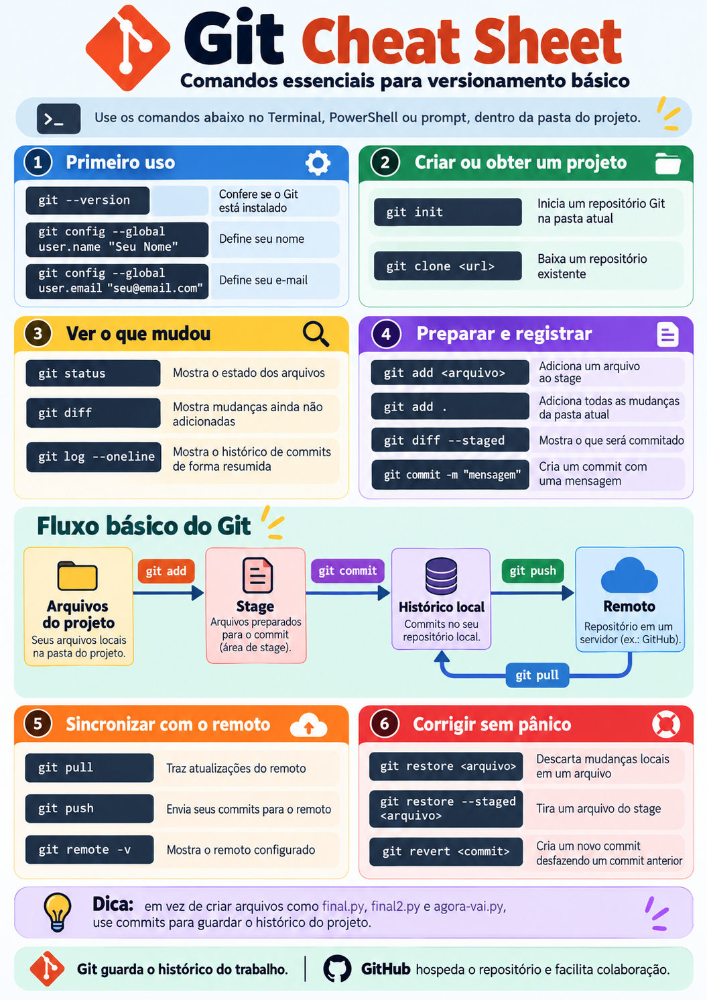

# Git: o mínimo para começar

Git é o controle de versão do projeto: ele guarda um histórico das mudanças. Em pesquisa computacional, isso ajuda a recuperar o raciocínio de uma análise, comparar versões e sincronizar trabalho sem depender de cópias espalhadas.

Em vez de:

```text
analise.py
analise_nova.py
analise_final.py
analise_final2.py
```

mantenha um único `analise.py`. **Com Git, a versão deixa de morar no nome do arquivo e passa a morar no histórico do projeto.**

Git ajuda a saber o que mudou, registrar marcos, comparar versões, recuperar o raciocínio de uma análise e sincronizar o projeto com um remoto. Ele não é um backup mágico: o histórico só inclui o que foi registrado em commits e enviado ao remoto quando isso for necessário.

## Onde executar os comandos

Os comandos `git ...` desta página são executados em um terminal aberto dentro da pasta do projeto. No Windows, você pode usar PowerShell ou Windows Terminal; no Linux e macOS, o Terminal. Os comandos Git mostrados aqui são os mesmos.

## Git não é GitHub

```text
Git
→ controla o histórico no seu computador.

GitHub, GitLab etc.
→ hospedam repositórios remotos e facilitam compartilhamento e colaboração.
```

Você pode usar Git sem GitHub. Um remoto é útil quando quiser sincronizar, compartilhar ou colaborar.

## Configuração inicial

Primeiro, confira se o Git está instalado e identifique os commits que você fizer:

```bash
git --version
git config --global user.name "Seu Nome"
git config --global user.email "seu@email.com"
```

O nome e o e-mail identificam seus commits. Essa configuração é feita uma vez por computador, salvo quando você quiser alterá-la.

## Criar ou obter um repositório

Se o seu projeto local ainda não usa Git, abra o terminal na pasta dele e inicialize o repositório:

```bash
git init
```

Se o projeto já existe em um repositório remoto, obtenha uma cópia dele:

```bash
git clone <url>
```

Normalmente é **um ou outro**: use `git init` para começar o histórico de uma pasta local; use `git clone` para obter um projeto Git que já existe.

## Modelo mental do Git

O Git separa o que você está editando do que será registrado no próximo marco:

```text
arquivos de trabalho
      │
      │ git add
      ▼
stage
      │
      │ git commit
      ▼
histórico local
      │
      │ git push
      ▼
remoto

git pull traz mudanças do remoto para o repositório local.
```

Também vale lembrar:

```text
git diff
→ mudanças ainda não adicionadas ao stage

git diff --staged
→ o que está preparado para o próximo commit
```

[](assets/git-cheat-sheet-ptbr.png)

Use a cheat sheet como referência rápida; as seções abaixo explicam o que cada etapa significa.

## O ciclo básico

Depois de editar um arquivo, percorra este ciclo curto:

```bash
git status
git diff

git add src/analyze.py
git diff --staged

git commit -m "add baseline orbital analysis"

git log --oneline
```

```text
status
→ o que está diferente?

diff
→ o que eu mudei?

add
→ quais mudanças entram no próximo registro?

diff --staged
→ o que exatamente será registrado?

commit
→ crie o marco

log
→ veja os marcos anteriores
```

`git add .` também adiciona as mudanças da pasta atual. Mesmo assim, escolher arquivos individualmente ajuda quando mudanças diferentes devem virar commits diferentes.

### O que é um commit?

Salvar o arquivo no editor e fazer um commit são coisas diferentes. Salvar atualiza o arquivo no disco; o commit registra um marco no histórico Git.

Uma mensagem de commit descreve o marco criado, por exemplo:

```text
add baseline anomaly analysis
fix pressure normalization
update figure after filtering
document experiment assumptions
```

Evite mensagens vagas como `changes`, `update` ou `final`: elas não ajudam você a entender depois por que aquele marco existe.

## Marcos reais em pesquisa

Um commit não precisa ser feito para cada tecla digitada. Registre uma etapa quando ela tiver um propósito claro, como:

- primeira análise funcionando;
- entrada de um novo conjunto de dados;
- correção de uma unidade;
- criação de uma nova figura;
- atualização das conclusões;
- versão usada em reunião;
- versão submetida.

Esses marcos tornam mais fácil relacionar código, dados adequados e resultados persistidos com a decisão ou comunicação para a qual foram usados.

## Remoto: `pull` e `push`

Depois de trabalhar localmente, consulte e sincronize o remoto quando necessário:

```bash
git remote -v
git pull
git push
```

- `git remote -v` mostra os remotos configurados.
- `git pull` traz mudanças do remoto.
- `git push` publica commits locais no remoto.

Quando você usa `git clone`, o remoto normalmente já fica configurado.

## Desfazer mudanças com cuidado

Se você adicionou um arquivo ao stage, mas quer retirá-lo do próximo commit sem apagar sua edição:

```bash
git restore --staged <arquivo>
```

Para desfazer um commit que já faz parte do histórico, criando outro commit que registra a reversão:

```bash
git revert <commit>
```

Você também pode usar:

```bash
git restore <arquivo>
```

**Atenção:** esse comando descarta as mudanças locais não commitadas daquele arquivo. Leia `git status` e `git diff` antes de usá-lo.

## O que não deve entrar no histórico

Nem tudo que aparece na pasta do projeto deve ser versionado. Em geral, mantenha fora do histórico:

- ambientes virtuais como `.venv/`;
- caches e builds temporários;
- credenciais;
- dados proprietários ou confidenciais;
- arquivos enormes sem necessidade;
- outputs descartáveis que não fazem parte dos resultados persistidos.

Use `.gitignore` para indicar arquivos e pastas que o Git deve ignorar. Para dados protegidos, mantenha o material em armazenamento autorizado separado, como descrito no [README](../README.md#nem-todo-dado-deve-estar-no-projeto).

## Continue aprendendo

Consulte [Referências e caminhos de estudo](references.md#git-e-trabalho-computacional) quando precisar avançar. As opções abaixo mantêm o foco em Git para pesquisa e em seu uso com GitHub quando fizer sentido:

- [LabMAP / IME-USP — Primeiros passos para Git e GitHub](https://labmap.ime.usp.br/tutoriais/2026-08-12-introducao-ao-git/): material em português voltado a iniciação científica, mestrado, doutorado e publicações.
- [Kit de sobrevivência digital para cientistas](https://github.com/compgeolab/kit), do CompGeoLab / IAG-USP: apresenta Git/GitHub dentro de um workflow científico.
- [Software Carpentry — Version Control with Git](https://swcarpentry.github.io/git-novice/): aprofunda o ciclo diretório de trabalho → stage → commit.
- [Pro Git em português](https://git-scm.com/book/pt-br/v2/Primeiros-Passos-Sobre-Controle-de-Vers%C3%A3o): referência mais completa.
- [GitHub Docs — Git basics](https://docs.github.com/pt/get-started/git-basics): útil para configuração e integração com GitHub.
