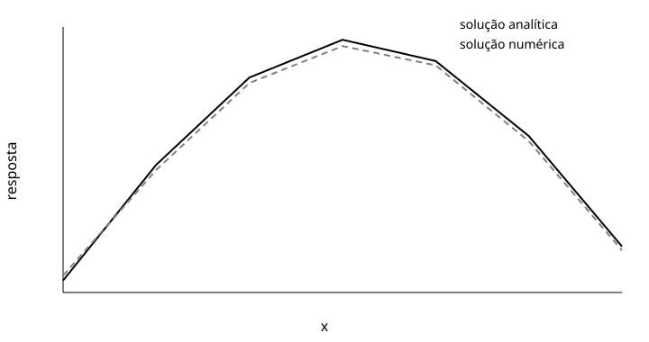

# Comparação analítica e numérica

Exemplo sintético de uma apresentação científica em Markdown.

---

## Pergunta

Quanto a solução numérica difere da solução analítica para os dados de exemplo?

---

## Dados e análise

```text
data/sample.csv
  ↓
src/analyze.py
  ↓
results/
```

O script lê os pares de valores, calcula o RMSE e salva uma tabela e uma figura.

---

## Resultado



A tabela gerada pelo script apresenta o RMSE e pode acompanhar esta figura no relatório.

---

## Conclusão

A solução numérica ficou próxima da solução analítica neste exemplo. A mesma figura também aparece no relatório em `examples/mini-project/docs/report.md`.
